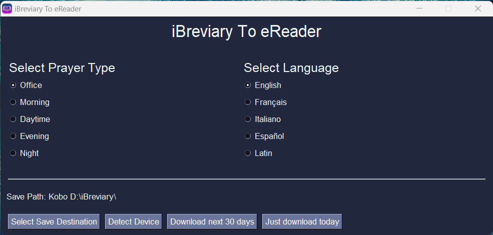

# eBreviary
Just a simple app to get the breviary on your eReader (Kobo or Kindle)

I made this in a few hours so it may or may not work. Hopefully it is useful. :)

You will need an internet connection.

Files are sourced from iBreviary. Please donate to them if you find this useful:
[Donate to iBreviary](https://www.ibreviary.org/en/ibreviary/help-us.html)

